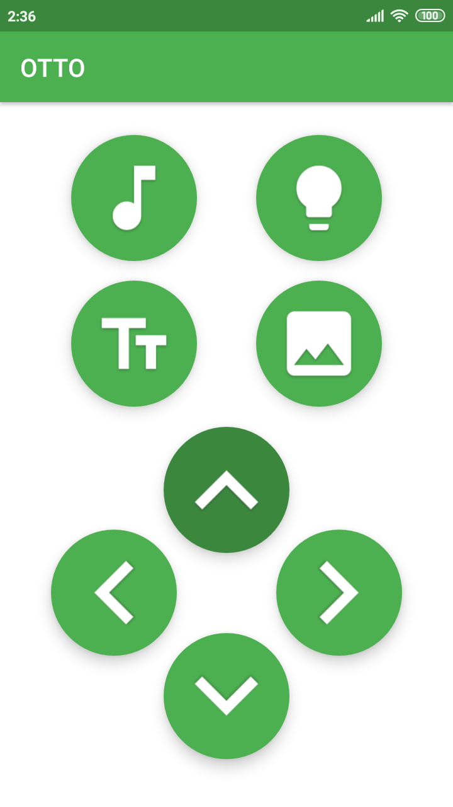
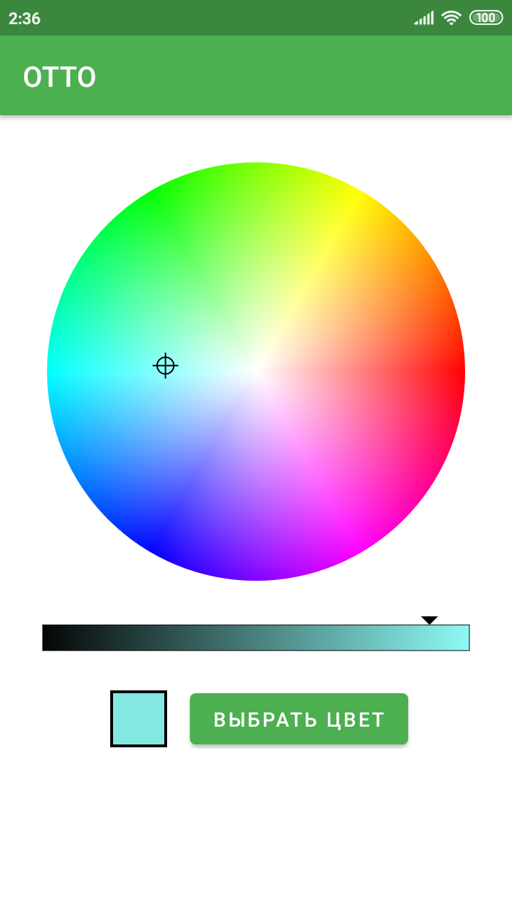
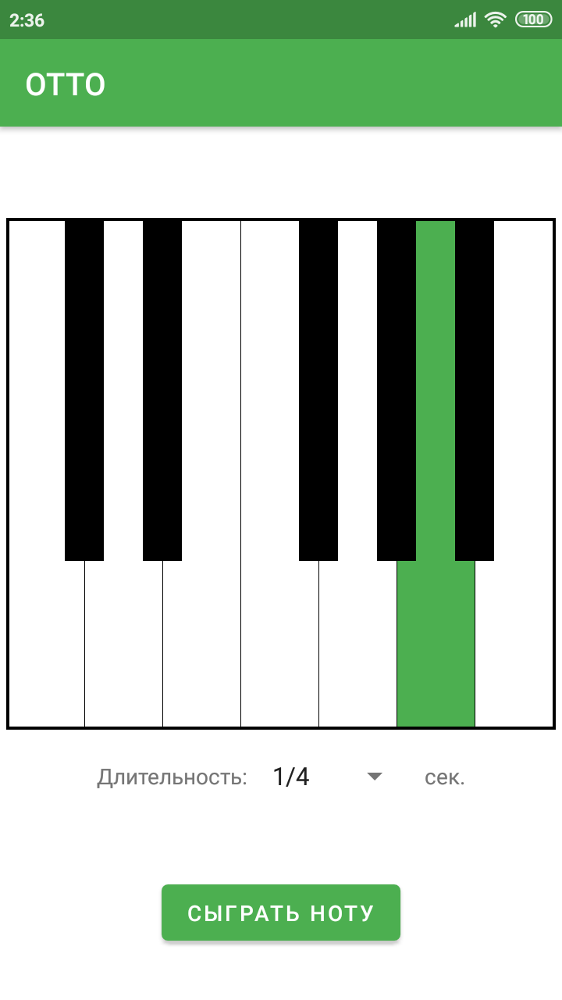
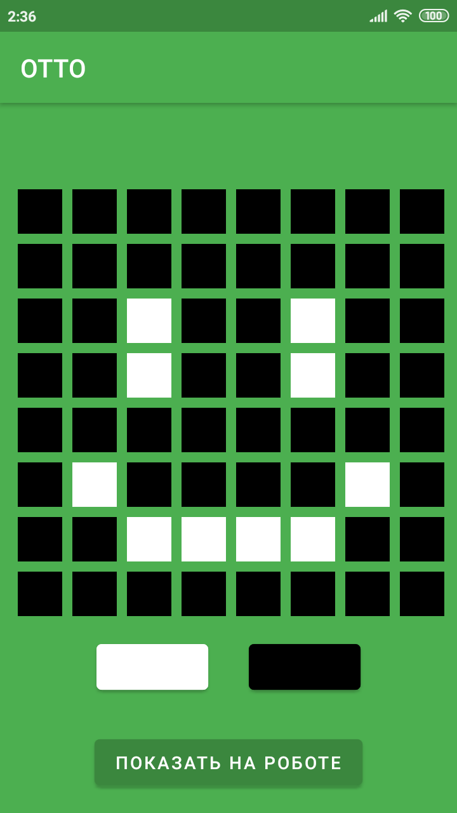

# OTTO

An Android app for controlling [OTTO, a robot by ROBBO](https://robbo.ru/products/otto/) via Bluetooth.

## Screenshots

Control panel | LED color picker
--- | --- 
 | 

Sound picker | Dot display
--- | --- 
 | 

## Built With

* [Kotlin](https://developer.android.com/kotlin)
* AndroidX libraries:
    * [Navigation component](https://developer.android.com/jetpack/androidx/releases/navigation)
    * [Lifecycle](https://developer.android.com/jetpack/androidx/releases/lifecycle) (LiveData, ViewModel)
* [ColorPicker](https://github.com/duanhong169/ColorPicker)

## Communicating to the robot

To define what data will be sent to the robot, edit `data/Action.kt`. `Action` class defines how the actions received
from the user would be converted into bytes to be sent to the robot. The following example shows how the text may be
converted into a byte sequence.

```kotlin
class ShowText(private val text: String) : Action() {
    override fun toBytes(): ByteArray {
        val header: Byte = 0b01011010
        return byteArrayOf(header) + text.toByteArray()
    }
}
```

## Getting data back from the robot

In order to get data back to the robot, you have to subscribe to `viewmodel/ViewModels.kt`
ByteArray Observable (or any data class you define, check it out for more info). `ViewModels`
object receives updates from the model and passes them to all its observers. (`viewmodel/ViewModels.kt` probably will be
moved to the `data/Repository.kt` or something like that in later releases, so be careful.)

There is the example of getting data with the ViewModel at `examples/ViewModelWithRobotCallback.kt`

## Creating your own control panel

After creating your own control panel and linking it with the ViewModel, you should define your own `Action` subclasses
to represent actions your panel allows performing. Then call `ActionRepository.sendAction(Action)` from your ViewModel.
See examples in `view/options/text/TextFragment.kt` and `view/options/text/TextViewModel.kt` or
`view/controlpanel/OttoControllerFragment.kt` and `view/controlpanel/OttoControllerViewModel.kt`.